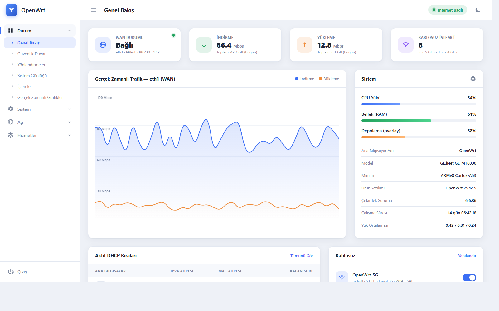
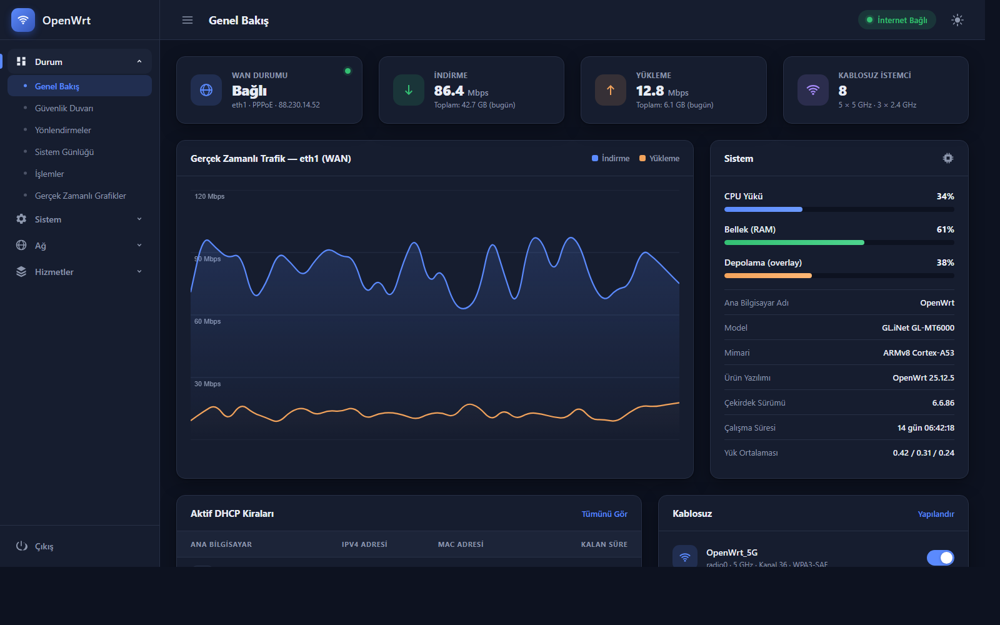

# luci-theme-gokce

Modern, collapsible-sidebar LuCI theme for OpenWrt, with Auto/Dark/Light modes.

Built for the current ucode-based LuCI (no `luasrc/` Lua templates), targeting
**OpenWrt 25.12**. Structurally based on the official `luci-theme-bootstrap`
package (Apache-2.0), with the top dropdown navigation replaced by a
left sidebar and the CBI form/table/button styling re-themed.

| Light | Dark |
|-------|------|
|  |  |

*Screenshots are from the standalone design demo in [`demo/`](demo/), which
mirrors the theme's design language and menu structure - open
`demo/index.html` in any browser to explore it without a router.*

## Features

- Left sidebar navigation (collapsible to icon-only, off-canvas on mobile),
  built from LuCI's real dynamic admin menu tree - no hardcoded app list.
  Top-level sections expand as accordion groups showing their second-level
  pages (Network → Interfaces / Wireless / ...); one group open at a time,
  the section being viewed starts expanded.
- Three registered theme entries in *System → System → Language and Style*:
  **Gokce** (follows the browser's OS-level dark/light preference),
  **GokceDark**, **GokceLight** (force one mode).
- A quick dark/light toggle button in the header (only shown when the
  **Gokce**/Auto theme is active) that overrides the OS preference for the
  current browser via `localStorage`, no page reload or re-login needed.
- Card-styled config sections, restyled buttons/forms/tables/tabs/alerts
  across all of LuCI's CBI-generated pages, not just a single dashboard view.
- No build step, no external fonts/CDNs/JS frameworks - plain CSS +
  vanilla `ucode`/JS, matching LuCI's own theme conventions.

## Installing

Grab the `.ipk`/`.apk` from a [Release](../../releases) or a CI build
artifact and install it on the router:

```sh
opkg install luci-theme-gokce_*.ipk      # older opkg-based images
# or
apk add --allow-untrusted luci-theme-gokce_*.apk   # apk-based images (25.12+)
```

Then select **Gokce** (or **GokceDark** / **GokceLight**) under
*System → System → Language and Style* and reload the page.

## Building

This repo has no local build step - packages are built entirely by the
`.github/workflows/build.yml` CI pipeline using the official
[`openwrt/gh-action-sdk`](https://github.com/openwrt/gh-action-sdk), which
pulls prebuilt OpenWrt SDK containers. Push a commit, open a PR, or run the
workflow manually (`workflow_dispatch`) to get a built package as a
downloadable artifact. Pushing a `v*` tag also attaches the built packages
to a GitHub Release.

If you do want to build locally against a real OpenWrt SDK/buildroot
checkout, add this repo as a feed (or symlink `luci-theme-gokce/` into
`package/`) and run `make package/luci-theme-gokce/compile V=s`.

## Package layout

The actual OpenWrt/LuCI package lives in the `luci-theme-gokce/` subdirectory
(not the repo root) - `openwrt/gh-action-sdk` links this whole repo in as a
feed, and OpenWrt's feed scanner only finds packages one directory level
down, in a folder named after the package.

```
luci-theme-gokce/
├── Makefile                                  # OpenWrt/LuCI package definition
├── root/etc/uci-defaults/30_luci-theme-gokce # registers the 3 theme entries in /etc/config/luci
├── ucode/template/themes/gokce/              # header.ut / footer.ut / sysauth.ut (ucode templates)
└── htdocs/luci-static/
    ├── gokce/                                 # cascade.css + logo.svg (the actual theme)
    ├── gokce-dark/                            # @import-only stylesheet (distinct mediaurlbase)
    ├── gokce-light/                           # @import-only stylesheet (distinct mediaurlbase)
    └── resources/menu-gokce.js                # sidebar renderer + toggle behavior
```

## Known limitations

- The sidebar shows two menu levels (sections + their pages); third-level
  navigation (e.g. tabs within a page) stays as a horizontal tab bar at the
  top of the content area, same depth as bootstrap's dropdown nav.
- The sidebar icon set only covers the well-known top-level sections
  (`status`, `system`, `network`, `services`, `vpn`, `firewall`); any other
  installed `luci-app-*` gets a generic dot icon.

## License

Apache-2.0, see [LICENSE](LICENSE). Portions of the ucode templates and
CSS selector structure are adapted from `luci-theme-bootstrap`
(Copyright the LuCI Team, Apache-2.0).
