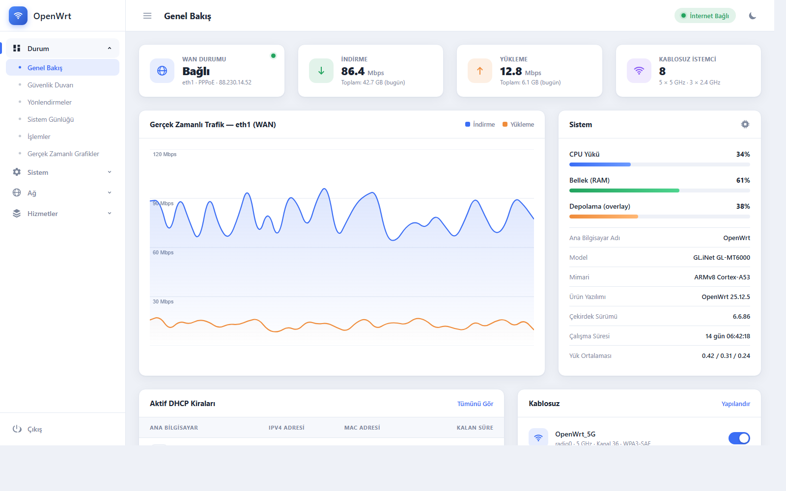
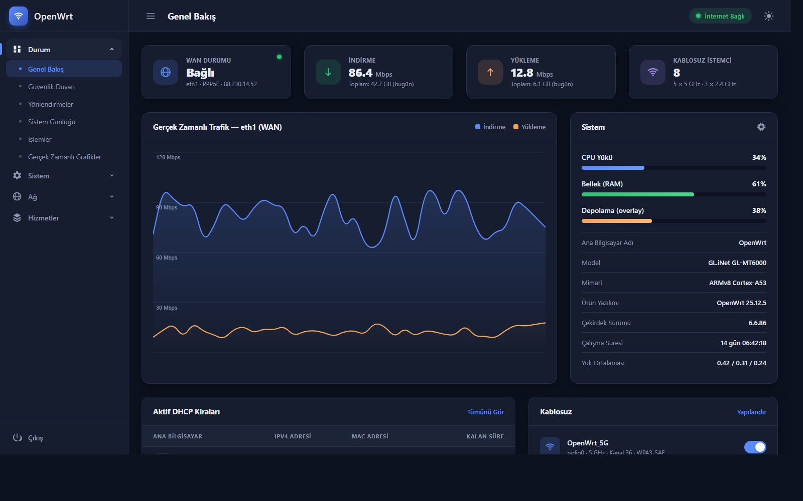
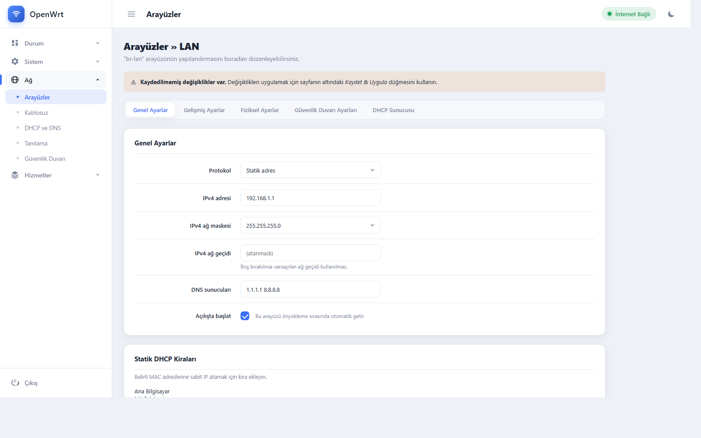
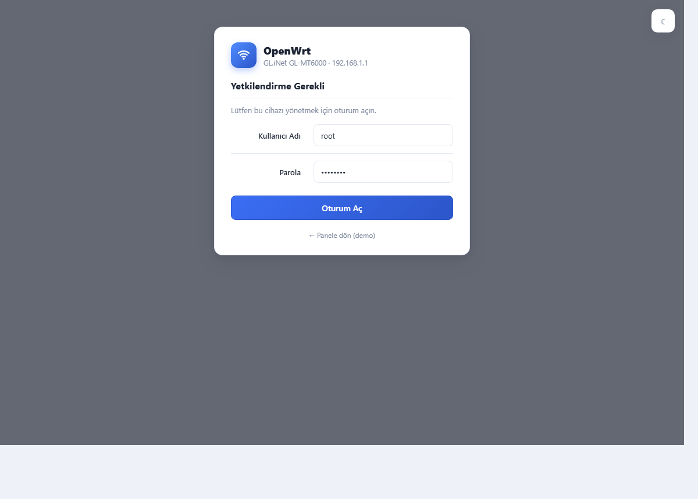
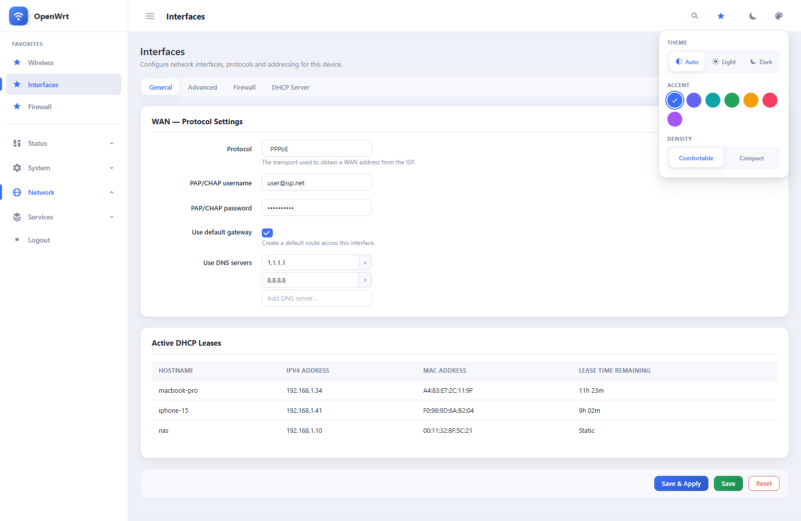
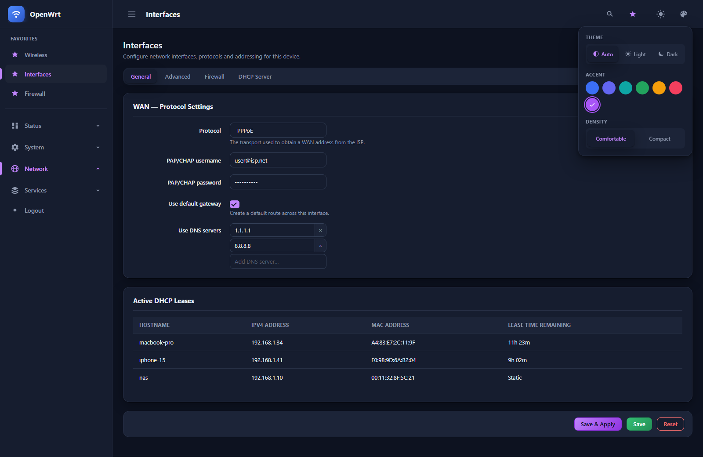
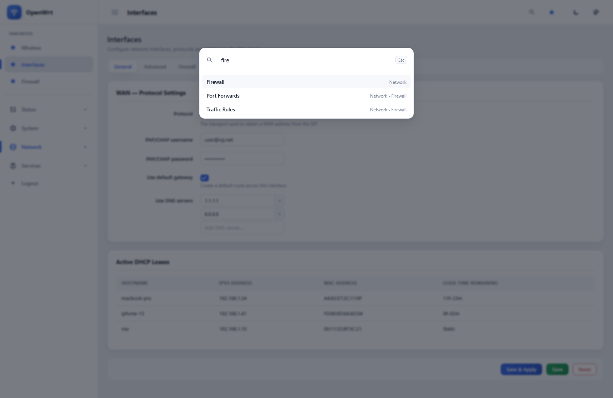
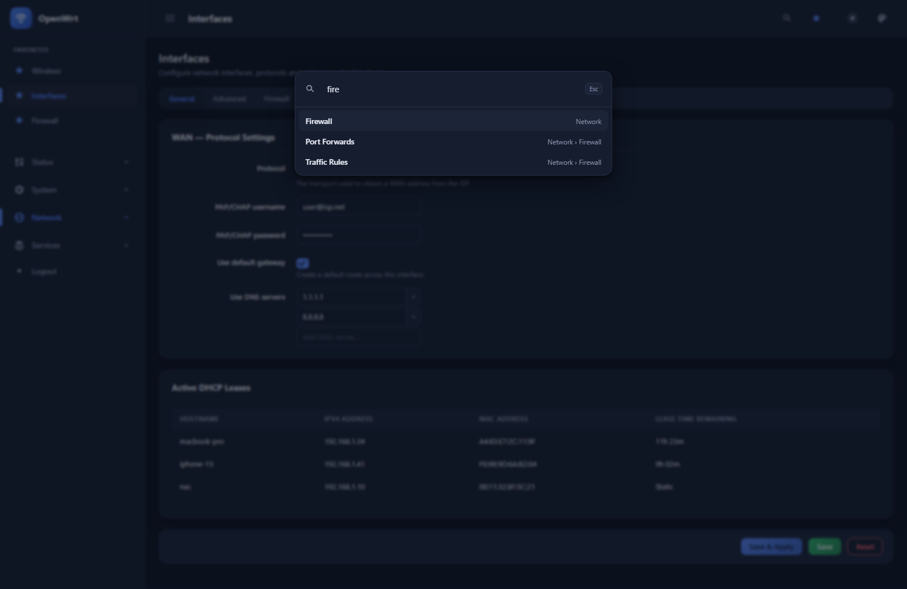

# luci-theme-gokce

Modern, collapsible-sidebar LuCI theme for OpenWrt, with Auto/Dark/Light modes.

Built for the current ucode-based LuCI (no `luasrc/` Lua templates), targeting
**OpenWrt 25.12**. Structurally based on the official `luci-theme-bootstrap`
package (Apache-2.0), with the top dropdown navigation replaced by a
left sidebar and the CBI form/table/button styling re-themed.

**Dashboard — light / dark**

| Light | Dark |
|-------|------|
|  |  |

**Config page (CBI form) & login screen**

| Config page | Login |
|-------------|-------|
|  |  |

**Appearance panel & quick page search — light / dark**

The appearance popover (theme mode / accent color / density), the pinned
*Favorites* block in the sidebar, and the `Ctrl`/`Cmd`+`K` command palette,
rendered from the theme's own `cascade.css` on a real CBI page:

| Appearance panel (blue accent) | Appearance panel (violet accent, dark) |
|--------------------------------|----------------------------------------|
|  |  |

| Quick page search | Quick page search (dark) |
|-------------------|--------------------------|
|  |  |

*The dashboard, config and login shots come from the standalone design demo in
[`demo/`](demo/), which mirrors the theme's design language, menu structure and
page types — open `demo/index.html` in any browser to explore it without a
router. The appearance/favorites/search shots are rendered directly from the
packaged theme's `cascade.css` and header markup, so they reflect the real
in-LuCI output.*

## Features

- Left sidebar navigation (collapsible to icon-only, off-canvas on mobile),
  built from LuCI's real dynamic admin menu tree - no hardcoded app list.
  Top-level sections expand as accordion groups showing their second-level
  pages (Network → Interfaces / Wireless / ...); one group open at a time,
  the section being viewed starts expanded.
- Three registered theme entries in *System → System → Language and Style*:
  **Gokce** (follows the browser's OS-level dark/light preference),
  **GokceDark**, **GokceLight** (force one mode).
- A quick dark/light toggle button in the header (only shown when the
  **Gokce**/Auto theme is active) that overrides the OS preference for the
  current browser via `localStorage`, no page reload or re-login needed.
- An **appearance panel** (palette button in the header) to personalize the
  UI, all persisted per-browser and applied before first paint (no flash):
  - **Theme mode** — Auto (follow OS) / Light / Dark, kept in sync with the
    quick toggle.
  - **Accent color** — 7 presets (blue, indigo, teal, green, amber, rose,
    violet), each tuned for both light and dark mode.
  - **Density** — Comfortable / Compact, tightening spacing for dense pages.
- **Favorites** — pin any page from the header star button; pinned pages
  surface in a *Favorites* block at the top of the sidebar (with a quick
  unpin control), persisted per-browser via `localStorage`.
- **Quick page search** — a command-palette (header search button or
  `Ctrl`/`Cmd`+`K`) that filters the whole admin menu by page title and
  breadcrumb; arrow keys + Enter to jump, Esc to close.
- Respects `prefers-reduced-motion`; ships a `.gokce-skeleton` shimmer
  utility for loading placeholders.
- Card-styled config sections, restyled buttons/forms/tables/tabs/alerts
  across all of LuCI's CBI-generated pages, not just a single dashboard view.
- No build step, no external fonts/CDNs/JS frameworks - plain CSS +
  vanilla `ucode`/JS, matching LuCI's own theme conventions.

## Installing

Grab the `.ipk`/`.apk` from a [Release](../../releases) or a CI build
artifact and install it on the router:

```sh
opkg install luci-theme-gokce_*.ipk      # older opkg-based images
# or
apk add --allow-untrusted luci-theme-gokce_*.apk   # apk-based images (25.12+)
# or

apk del --allow-untrusted luci-theme-gokce
rm -rf /tmp/luci-indexcache /tmp/luci-modulecache
apk add --allow-untrusted  --no-network  luci-theme-gokce_*.apk
rm -rf /tmp/luci-indexcache /tmp/luci-modulecache

```

Then select **Gokce** (or **GokceDark** / **GokceLight**) under
*System → System → Language and Style* and reload the page.

## Building

This repo has no local build step - packages are built entirely by the
`.github/workflows/build.yml` CI pipeline using the official
[`openwrt/gh-action-sdk`](https://github.com/openwrt/gh-action-sdk), which
pulls prebuilt OpenWrt SDK containers. Push a commit, open a PR, or run the
workflow manually (`workflow_dispatch`) to get a built package as a
downloadable artifact. Pushing a `v*` tag also attaches the built packages
to a GitHub Release.

If you do want to build locally against a real OpenWrt SDK/buildroot
checkout, add this repo as a feed (or symlink `luci-theme-gokce/` into
`package/`) and run `make package/luci-theme-gokce/compile V=s`.

## Package layout

The actual OpenWrt/LuCI package lives in the `luci-theme-gokce/` subdirectory
(not the repo root) - `openwrt/gh-action-sdk` links this whole repo in as a
feed, and OpenWrt's feed scanner only finds packages one directory level
down, in a folder named after the package.

```
luci-theme-gokce/
├── Makefile                                  # OpenWrt/LuCI package definition
├── root/etc/uci-defaults/30_luci-theme-gokce # registers the 3 theme entries in /etc/config/luci
├── ucode/template/themes/gokce/              # header.ut / footer.ut / sysauth.ut (ucode templates)
└── htdocs/luci-static/
    ├── gokce/                                 # cascade.css + logo.svg (the actual theme)
    ├── gokce-dark/                            # @import-only stylesheet (distinct mediaurlbase)
    ├── gokce-light/                           # @import-only stylesheet (distinct mediaurlbase)
    └── resources/menu-gokce.js                # sidebar renderer + toggle behavior
```

## Known limitations

- The sidebar shows two menu levels (sections + their pages); third-level
  navigation (e.g. tabs within a page) stays as a horizontal tab bar at the
  top of the content area, same depth as bootstrap's dropdown nav.
- The sidebar icon set only covers the well-known top-level sections
  (`status`, `system`, `network`, `services`, `vpn`, `firewall`); any other
  installed `luci-app-*` gets a generic dot icon.

## License

**Gökçe Theme License v1.0** — a source-available (not OSI open-source)
license; see [LICENSE](LICENSE). In short:

- You may use and run the theme freely, on any number of devices.
- You may redistribute it **only as a fork** of this repository — not
  re-uploaded as a new, unrelated project.
- The footer credit **"Gökçe Theme by Dursun Tokgöz"** and its links must
  stay visible and functional. Removing, hiding, or re-pointing it ends your
  right to use the software. You may add your own credit alongside it.

Portions of the ucode templates, the login view JS, and the CSS selector
structure are derived from `luci-theme-bootstrap` (Copyright the LuCI Team)
and remain under **Apache-2.0**; see [NOTICE](NOTICE).
